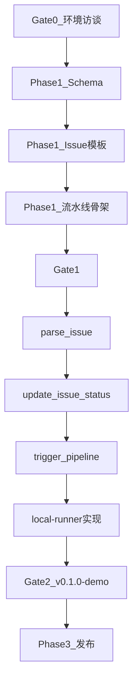

# OpsPulse 实施计划

> **版本**：v1.0.0  
> **日期**：2026-07-05  
> **范围**：Phase 0 收尾 → Phase 1 骨架 → Phase 2 MVP（v0.1.0 可演示）  
> **原则**：Gate 未通过不进入下一阶段；每周三前交付可运行增量；无 `sample-backend`（D11）

**关联文档**：[整体规划](./OpsPulse整体项目规划.md) | [技术架构](./技术架构.md) | [ROADMAP](./ROADMAP.md) | [PREREQUISITES](./PREREQUISITES.md) | [用户接入指南](./用户接入指南.md)

---

## 一、实施总览

### 1.1 目标里程碑

| 里程碑 | 时间 | 交付物 | 验收 |
|--------|------|--------|------|
| **Gate 0** | D+3 | 环境 + 访谈就绪 | PREREQUISITES 全绿 |
| **Gate 1** | W4 末 | 仓库骨架 + Issue Spec | Schema CI 绿 |
| **Gate 2 / v0.1.0-demo** | W8 末 | MCP + 流水线 + E2E | Issue #1 全链路 < 30min |
| **v0.1.0 发布** | M3 | 公众号文章 1 + 公开仓库 | Star ≥ 30 |

### 1.2 实施架构（MVP 范围）

```
Phase 1 产出                     Phase 2 产出
────────────                     ────────────
schemas/issue-spec.v1.json  →   mcp-server/parse_issue
.github/ISSUE_TEMPLATE/     →   mcp-server/update_issue_status
examples/issues/            →   mcp-server/trigger_pipeline
opspulse.yaml               →   local-runner/ + harness-templates/
.cursor/mcp.json            →   docs/quickstart.md
```

### 1.3 不在 MVP 范围（明确排除）

- `sample-backend/` 微服务工程（D11，Phase 4+ 按需）
- Webhook 自动触发（Phase 3）
- `opspulse-pro` 付费插件（Phase 4）
- Harness 实机联调（v0.3.0，M5–M6）

---

## 二、Phase 0 收尾（预计 3 天）

> 规划文档已完成 ✅，剩余人工项如下。

### 2.1 任务清单

| # | 任务 | 产出 | 负责人 | 状态 |
|---|------|------|--------|------|
| 0.1 | 安装并验证 Python 3.11 + uv + Docker | 终端截图或日志 | 你 | ⬜ |
| 0.2 | 创建 GitHub PAT，写入本地 `.env` | `.env`（不提交） | 你 | ⬜ |
| 0.3 | Cursor 安装 + Docker 拉取 github-mcp-server | MCP 可启动 | 你 | ⬜ |
| 0.4 | 运行 `scripts/check-prerequisites.sh` | 退出码 0 | 你 | ⬜ |
| 0.5 | 用户访谈 #1（同事/前同事/社群） | `doc/interviews/001.md` | 你 | ⬜ |
| 0.6 | 微信公众号注册（可不发文） | 账号记录 | 你 | ⬜ |
| 0.7 | Gate 0 自检 | 更新 PREREQUISITES §6 | 你 | ⬜ |

### 2.2 访谈 #1 必问（验证价值假设）

1. Issue 到上线有几个手工环节？最痛是哪段？
2. 是否使用 JDK8 企业基础镜像 + 微服务独立 build？
3. 愿不愿意在 Issue 里写 YAML frontmatter 验收标准？
4. 记录对方 `jdk_base_image` 命名习惯（如有）

### 2.3 Gate 0 通过标准

- [ ] `check-prerequisites.sh` 通过
- [ ] `doc/interviews/001.md` 已填写
- [ ] GitHub PAT 可用（`gh auth status` 或 API 测试）
- [ ] PREREQUISITES §6 全部 ✅

---

## 三、Phase 1 — 仓库骨架（W3–W4，10 个工作日）

### 3.1 W3：Git 基建 + Schema（D1–D5）

#### Day 1：仓库初始化

| 序号 | 文件/动作 | 说明 |
|------|-----------|------|
| 1.1 | `git init` + GitHub remote | 仓库名建议 `opspulse/opspulse` |
| 1.2 | `.gitignore` | `.env`, `__pycache__`, `.venv`, `target/`, `.DS_Store` |
| 1.3 | `LICENSE` | Apache-2.0 全文 |
| 1.4 | `.env.example` | `GITHUB_PAT`, `JDK_BASE_IMAGE`, `OPS_PULSE_CONFIG` |
| 1.5 | `opspulse.yaml` | 全局默认：`jdk_base_image`, `registry`, `deploy_mode` |

**opspulse.yaml 最小结构**：

```yaml
version: "1"
defaults:
  runtime:
    jdk_base_image: eclipse-temurin:8-jre   # 本地演示用；生产改企业镜像
  build:
    jdk: "1.8"
    tool: maven
  deploy:
    env: dev
pipeline:
  default_mode: local   # local | github-actions | harness
```

#### Day 2：Issue Spec Schema

| 序号 | 文件 | 说明 |
|------|------|------|
| 1.6 | `schemas/issue-spec.v1.json` | JSON Schema，字段见技术架构 §5.1 |
| 1.7 | `scripts/validate-issue-spec.py` | 读取 frontmatter，jsonschema 校验 |
| 1.8 | `scripts/tests/test_validate_issue_spec.py` | 至少 3 个用例：合法/缺字段/bugfix 无复现 |

**Schema 必填字段（MVP）**：

- `opspulse_version`, `type`, `service.name`
- `runtime.jdk_base_image`
- `build.command`, `build.artifact`
- `acceptance`（≥1 条）
- `deploy.env`

#### Day 3：Issue 样例 + 模板

| 序号 | 文件 | 说明 |
|------|------|------|
| 1.9 | `examples/issues/001-order-service-feature.md` | 完整 frontmatter + 背景 |
| 1.10 | `examples/issues/002-user-service-bugfix.md` | 含复现步骤 |
| 1.11 | `examples/issues/003-config-chore.md` | chore 类型 |
| 1.12 | `.github/ISSUE_TEMPLATE/auto-dev-feature.yml` | 自动标签 `opspulse:auto` |
| 1.13 | `.github/ISSUE_TEMPLATE/auto-dev-bugfix.yml` | 必填复现步骤 |

#### Day 4–5：README + CI 骨架

| 序号 | 文件 | 说明 |
|------|------|------|
| 1.14 | `README.md` | 定位、三层架构图、30 秒快速开始、文档索引、链到用户接入指南 |
| 1.15 | `CONTRIBUTING.md` | PR 流程、Issue 规范 |
| 1.16 | `.github/workflows/validate-schema.yml` | PR 时跑 `validate-issue-spec.py` |
| 1.17 | `.github/pull_request_template.md` | 关联 Issue、验收勾选 |

**Gate 1 检查（W3 末）**：

```bash
python scripts/validate-issue-spec.py examples/issues/001-order-service-feature.md
# 期望：exit 0
```

---

### 3.2 W4：流水线模板骨架 + MCP 配置

#### Day 6–7：Harness 模板 + 本地 Runner 骨架

| 序号 | 文件 | 说明 |
|------|------|------|
| 1.18 | `harness-templates/pipeline-pr-validation.yaml` | 5 阶段占位（见技术架构 §6.2） |
| 1.19 | `harness-templates/pipeline-deploy-dev.yaml` | 5 阶段占位 |
| 1.20 | `harness-templates/templates/stage-*.yaml` | 6 个 stage 模板文件 |
| 1.21 | `local-runner/run-pipeline.sh` | 入口：`pr-validation` / `deploy-dev` |
| 1.22 | `local-runner/docker-compose.yml` | 演示用 compose |
| 1.23 | `examples/fixtures/deploy/order-service/Dockerfile` | `FROM ${JDK_BASE_IMAGE}` 示例 |
| 1.24 | `examples/fixtures/app.jar` | 占位空 jar 或 README 说明如何生成 |

**Dockerfile 模板**（1.23）：

```dockerfile
ARG JDK_BASE_IMAGE=eclipse-temurin:8-jre
FROM ${JDK_BASE_IMAGE}
WORKDIR /app
COPY app.jar /app/app.jar
EXPOSE 8080
ENTRYPOINT ["java", "-jar", "/app/app.jar"]
```

#### Day 8：MCP 配置 + Prompts

| 序号 | 文件 | 说明 |
|------|------|------|
| 1.25 | `.cursor/mcp.json` | github + opspulse（opspulse 先占位） |
| 1.26 | `.cursor/rules/issue-to-deploy.mdc` | Agent 规则：先 parse_issue 再改代码 |
| 1.27 | `prompts/issue-to-code.md` | JDK8 微服务开发指令模板 |
| 1.28 | `prompts/pipeline-troubleshoot.md` | 流水线失败排查 |

#### Day 9–10：文档 + Gate 1

| 序号 | 文件 | 说明 |
|------|------|------|
| 1.29 | `docs/mcp-setup.md` | PAT、Docker、Cursor 配置步骤 |
| 1.30 | `docs/harness-setup.md` | Harness 可选接入说明 |
| 1.31 | `CHANGELOG.md` | v0.0.1-schema 记录 |
| 1.32 | Gate 1 评审 | 更新 ROADMAP 状态 |

**Gate 1 通过标准**：

- [ ] `git push` 成功，GitHub 上 Issue 模板可选
- [ ] `validate-schema.yml` CI 绿
- [ ] 3 个 `examples/issues/` 全部通过 Schema 校验
- [ ] `local-runner/run-pipeline.sh` 可执行（允许 stage 为 echo 占位）

---

## 四、Phase 2 — MVP 实现（W5–W8，20 个工作日）

### 4.1 mcp-server 工程结构

```
mcp-server/
├── pyproject.toml
├── README.md
├── src/opspulse_mcp/
│   ├── __init__.py
│   ├── server.py              # FastMCP 入口
│   ├── config.py              # 读取 opspulse.yaml
│   ├── models/
│   │   └── issue_spec.py      # Pydantic 模型
│   ├── parsers/
│   │   ├── frontmatter.py
│   │   └── label_mapper.py
│   └── tools/
│       ├── parse_issue.py
│       ├── trigger_pipeline.py
│       └── update_issue_status.py
└── tests/
    ├── test_parse_issue.py
    ├── test_trigger_pipeline.py
    └── test_update_issue_status.py
```

**pyproject.toml 依赖**：

- `mcp[cli]` 或 `fastmcp`
- `pydantic`, `pyyaml`, `jsonschema`, `httpx`（GitHub API fallback）

---

### 4.2 W5：`parse_issue`（D6–D10）

| 天 | 任务 | 验收 |
|----|------|------|
| D1 | 初始化 `mcp-server/`，`server.py` 空壳可启动 | `uv run opspulse-mcp` 不报错 |
| D2 | `frontmatter.py`：从 Markdown 提取 YAML | 单元测试 3 例 |
| D3 | `label_mapper.py`：标签 fallback | `type:feature` → `spec.type` |
| D4 | `parse_issue` tool：合并 frontmatter + labels | 输出 `ready` + `errors[]` |
| D5 | 门禁逻辑：bugfix 无复现 → `ready=false` | 002 样例被拒绝 |

**parse_issue 验收用例**：

```bash
# 本地调试（不依赖 GitHub）
uv run python -m opspulse_mcp.tools.parse_issue \
  --file examples/issues/001-order-service-feature.md
# 期望：ready=true, service.name=order-service
```

---

### 4.3 W6：`update_issue_status` + GitHub 联调（D11–D15）

| 天 | 任务 | 验收 |
|----|------|------|
| D1 | Comment Markdown 模板（含 acceptance 勾选） | 快照测试 |
| D2 | `update_issue_status` tool 实现 | 输出 `comment_body` |
| D3 | 对接 github-mcp-server 或 GitHub REST | 能在测试 Issue 写 Comment |
| D4 | 状态机：`parsed→in-dev→pr-open→testing→deployed→failed` | 非法跳转报错 |
| D5 | 集成测试：对 OpsPulse 仓库真实 Issue 回写 | 人工确认 Comment 格式 |

**Comment 模板片段**：

```markdown
## OpsPulse Delivery Status

| 字段 | 值 |
|------|-----|
| state | `deployed` |
| service | order-service |
| jdk_base_image | registry.example.com/platform/jdk8-base:1.0 |

### Acceptance
- [x] AC-1: health UP
- [ ] AC-2: API 变更已验证
```

---

### 4.4 W7：`trigger_pipeline` + local-runner（D16–D20）

| 天 | 任务 | 验收 |
|----|------|------|
| D1 | `run-pipeline.sh` 实现 `pr-validation` 5 阶段 | 日志逐步输出 |
| D2 | Stage: `jdk_base_verify` — `docker pull $JDK_BASE_IMAGE` | 镜像存在 |
| D3 | Stage: `microservice_build` — MVP 用 `SKIP_BUILD=1` + fixture jar | 可配置跳过 |
| D4 | Stage: `service_image_build` + `smoke_test` | 容器启动 |
| D5 | `trigger_pipeline` tool 调用 local-runner | 返回 `stage_results[]` |

**local-runner 环境变量**：

```bash
export JDK_BASE_IMAGE=eclipse-temurin:8-jre
export SERVICE_NAME=order-service
export SKIP_BUILD=1                    # MVP：无用户仓库时跳过 mvn
export ARTIFACT_PATH=examples/fixtures/app.jar
```

**pr-validation 流程**：

```
validate_spec → jdk_base_verify → microservice_build → service_image_build → smoke_test
```

---

### 4.5 W8：deploy-dev + E2E + quickstart（D21–D25）

| 天 | 任务 | 验收 |
|----|------|------|
| D1 | `deploy-dev` pipeline 实现 | compose 启动成功 |
| D2 | 串联：parse → trigger(pr-validation) → trigger(deploy-dev) → update | 脚本一键跑通 |
| D3 | `docs/quickstart.md`：30 分钟指南 | 按文档逐步可复现 |
| D4 | `.cursor/mcp.json` 联调 Cursor Agent | 手动走通 Issue #1 |
| D5 | Gate 2 评审 + 打 tag `v0.1.0-demo` | 录屏 5 分钟 |

**Gate 2 E2E 脚本**（`scripts/e2e-demo.sh`）：

```bash
#!/usr/bin/env bash
set -euo pipefail
ISSUE_FILE=examples/issues/001-order-service-feature.md

echo "== 1. parse_issue =="
uv run python -m opspulse_mcp.tools.parse_issue --file "$ISSUE_FILE"

echo "== 2. pr-validation =="
./local-runner/run-pipeline.sh pr-validation --issue-file "$ISSUE_FILE"

echo "== 3. deploy-dev =="
./local-runner/run-pipeline.sh deploy-dev --issue-file "$ISSUE_FILE"

echo "== 4. update_issue_status (dry-run) =="
uv run python -m opspulse_mcp.tools.update_issue_status --dry-run --state deployed

echo "E2E PASSED"
```

**Gate 2 通过标准**：

- [ ] `scripts/e2e-demo.sh` 退出码 0
- [ ] TTFV < 30min（第三人按 quickstart 实测）
- [ ] `mcp-server/tests/` 覆盖率 ≥ 60%
- [ ] 更新 CHANGELOG `v0.1.0-demo`

---

## 五、Phase 3 预览（M3–M6，实施计划 v2 展开）

| 版本 | 核心增量 |
|------|----------|
| v0.1.0 | 公开发布 + 文章 1 |
| v0.2.0 | GHA workflow 等价于 local-runner + 标签 fallback 增强 |
| v0.3.0 | Harness Remote Template 实机 + 用户真实微服务仓库接入指南 |

**第一个真实案例（强烈建议）**：

在你自己的 JDK8 微服务仓库中：

1. 复制 `schemas/` + `.github/ISSUE_TEMPLATE/` + `harness-templates/`
2. 填真实 `jdk_base_image` 与 `service.module_path`
3. 跑通一次真实 Issue → build → deploy
4. 作为文章 1 的核心案例（比 OpsPulse 内 fixtures 更有说服力）

---

## 六、任务依赖图



**关键路径**：Schema → parse_issue → local-runner → E2E

---

## 七、每周交付节奏（实施期强制）

| 日 | 动作 |
|----|------|
| 周一 | 从本计划勾选本周任务；更新 `doc/weekly/YYYY-WW.md` |
| 周三前 | **可运行交付**（脚本/Tool/阶段） |
| 周四 | 用户对话 30min；记录到 interviews |
| 周五 | 更新需求池、KPI；标记本计划任务状态 |

---

## 八、风险与应对（实施期）

| 风险 | 信号 | 应对 |
|------|------|------|
| github-mcp Docker 启动失败 | Cursor 连不上 | 改用 GitHub REST 直接调用 |
| 无真实 jar 无法 demo build | smoke test 失败 | `SKIP_BUILD=1` + fixture jar（已规划） |
| FastMCP API 变更 | 启动报错 | 锁定版本号于 pyproject.toml |
| Issue Spec 太复杂 | 访谈反馈「不愿写」 | 简化必填字段；模板预填 80% |

---

## 九、实施检查表（可打印）

### Phase 0
- [ ] Python + uv + Docker 验证
- [ ] GitHub PAT
- [ ] 访谈 001
- [ ] Gate 0

### Phase 1
- [ ] Git 仓库公开
- [ ] issue-spec.v1.json + CI
- [ ] 3 个 Issue 样例
- [ ] Issue 模板
- [ ] local-runner 骨架
- [ ] Gate 1

### Phase 2
- [ ] parse_issue
- [ ] update_issue_status
- [ ] trigger_pipeline
- [ ] local-runner 5 阶段
- [ ] e2e-demo.sh
- [ ] quickstart.md
- [ ] Gate 2 / v0.1.0-demo

---

## 十、下一步行动（今天可做）

1. 完成 **Phase 0 剩余 3 项**（环境验证、PAT、访谈 001）
2. 说 **「开始 Phase 1」** → 按 §3.1 Day 1 初始化仓库
3. 访谈时带上 `examples/issues/001` 草稿征求反馈

---

## 修订记录

| 版本 | 日期 | 变更 |
|------|------|------|
| v1.0.0 | 2026-07-05 | 首版：Phase 0–2 详细实施计划 |
