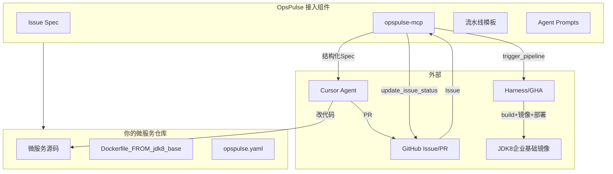
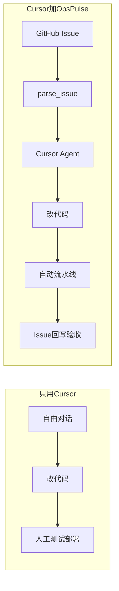

# OpsPulse 用户接入指南

> **回答两个核心问题**：  
> 1. OpsPulse 最终如何介入到你的项目？  
> 2. 和「直接在 Cursor 里跟 AI 对话」有什么差异？

**关联**：[技术架构](./技术架构.md) | [实施计划](./实施计划.md) | [PROJECT_CHARTER](./PROJECT_CHARTER.md)

---

## 一、最终形态：OpsPulse 是什么、不是什么

| 是 | 不是 |
|----|------|
| 可 fork 进微服务仓库的**交付流程脚手架** | 替代 Cursor / Copilot 的 AI 编码工具 |
| 本地运行的 **MCP Server**（结构化读 Issue、触发流水线） | 托管业务代码的 SaaS 平台 |
| Issue Spec + 流水线模板 + Agent Prompt 规范 | 重建企业 JDK8 基础镜像 |
| Issue → 开发 → CI → 回写的**胶水层** | Jira / 项目管理系统 |

**一句话**：Cursor 是「动手写代码的人」；OpsPulse 是「包工头 + 质检 + 交付流程」。

---

## 二、如何介入到你的项目

OpsPulse **不接管**你的微服务源码，也**不应**把 MCP、local-runner、prompts 整套复制进每个服务。

### 2.0 两种接入形态（先选对）

| 形态 | 胶水在哪 | 业务仓库里有什么 | 适合 |
|------|----------|------------------|------|
| **中心化胶水（推荐）** | OpsPulse 仓库 / 全局 MCP 安装 | **几乎不动**：最多 Issue 模板 + 一行 GHA 调用 | 多微服务、单体仓库多模块、不想污染业务仓 |
| **嵌入式试点（仅本地演示）** | 复制进业务仓的 `local-runner` 等 | 一整套模板文件 | 个人离线试跑；**不是生产推荐形态** |

**核心原则**：胶水在 **Issue 契约 + MCP + CI 触发** 这一层；微服务仓库继续只有业务代码和你原有的 Dockerfile/CI。

```
                    ┌─────────────────────┐
  GitHub Issue ────►│  OpsPulse (胶水层)   │
  (工单契约)        │  parse_issue        │
                    │  trigger_pipeline   │────► 你已有的 GHA / Harness
                    │  update_issue_status│────►  Issue Comment 回写
                    └─────────┬───────────┘
                              │ 结构化 Spec（服务名、模块路径、验收）
                              ▼
                    ┌─────────────────────┐
                    │  你的业务仓库        │
                    │  只改 affected_paths │◄── Cursor Agent
                    │  里的业务代码        │
                    └─────────────────────┘
```

**单体仓库多模块**（如 `chuanplus-platform` 含 gateway/web/bpm…）：
- **只对接仓库一次**，不是每个模块 bootstrap 一遍
- Issue 的 `service.name` + `module_path` 指向本次要改的**那一个模块**
- 其他模块不受影响

**多仓库微服务**（每个服务独立 Git 仓）：
- 同样**不是**每个仓复制一套 OpsPulse
- 推荐：GitHub **组织级** Issue 模板 + **全局** Cursor MCP 配置 + 各仓已有 CI 被 `trigger_pipeline` 远程触发

### 2.1 三层交付模型（介入时要对齐的）

```
Layer 1  企业 JDK8 基础镜像（OS + JVM + 公共依赖）     ← 你只引用，OpsPulse 不重建
         registry.example.com/platform/jdk8-base:1.0

Layer 2  你的微服务工程（order-service、user-service）  ← 业务代码本来就在这里
         services/order-service/、pom.xml、application.yml

Layer 3  服务镜像 / 部署单元（每次 Issue 可能变）       ← 流水线自动：FROM 底座 + COPY jar
         registry.example.com/order-service:issue-45-abc
```

### 2.2 业务仓库里「应该 / 不应该」有什么

**不应该放进去（留在 OpsPulse 或全局安装）：**

| 组件 | 应放位置 |
|------|----------|
| `mcp-server` / `opspulse-mcp` | OpsPulse 仓库，或 `uv` 全局安装 |
| `local-runner/` | **仅 OpsPulse 演示仓**；本地试跑胶水逻辑 |
| `prompts/`、`schemas/` | OpsPulse 仓，或组织级模板库 |
| `.cursor/mcp.json` | Cursor **用户级**配置，或打开 OpsPulse 仓时生效 |

**可以放进去（轻量、一次性）：**

| 组件 | 说明 |
|------|------|
| `.github/ISSUE_TEMPLATE/` | 组织级或**单体仓根目录一份**即可 |
| 一行 GHA workflow | 调用可复用 workflow / `workflow_dispatch` |
| `opspulse.yaml`（可选） | 单体仓根目录写默认 JDK 底座；也可写在 Issue frontmatter |

**本来就在、OpsPulse 不碰：**

```
你的业务仓库/
├── chuanplus-platform-gateway/   # 模块 / 微服务代码（已有）
│   ├── src/
│   ├── pom.xml
│   └── Dockerfile                # 已有，不改架构
├── chuanplus-platform-web/
└── pom.xml                       # 多模块父工程
```

> `bootstrap-to-repo.sh` 属于**嵌入式试点**，会把一整套文件拷进业务仓，**容易让人误以为每个服务都要这样**——生产接入请用 §2.0 中心化胶水形态。

### 2.3 三种接入级别（修订）

| 级别 | 业务仓改动 | 胶水在哪 | 适合 |
|------|------------|----------|------|
| **A 最小（推荐起步）** | 零或仅组织级 Issue 模板 | 全局 MCP + GitHub Issue | 验证「工单驱动」是否比自由对话好 |
| **B 标准** | A + 可选根目录 `opspulse.yaml` | OpsPulse 仓跑 MCP；`trigger_pipeline` 调你现有 CI | 单体仓 / 小团队 |
| **C 完整** | B + 薄 GHA workflow（~20 行） | + Harness 模板 / 多环境 | 平台组统一规范 |

~~每个微服务复制 `local-runner` + `mcp-server`~~ — **不推荐**。

### 2.4 接入流程（中心化胶水，首次约 1–2 小时）

```
1. 在 OpsPulse 仓安装 MCP（或全局 uv install），配置 Cursor 用户级 mcp.json
2. （可选）在 GitHub 组织或业务仓根目录添加 Issue 模板
3. 在业务仓 GitHub 上创建 Issue，frontmatter 写明 service + module_path + affected_paths
4. Cursor 打开业务仓（如 chuanplus-platform），Agent：「处理 Issue #N」
5. parse_issue（从 GitHub 拉取）→ Agent 只改 affected_paths
6. trigger_pipeline 触发业务仓已有 CI（或 workflow_dispatch）
7. update_issue_status 回写 Issue Comment
```

~~Fork 整套模板进每个微服务仓~~ — 仅 `bootstrap-to-repo.sh` 本地试点时用。

### 2.5 架构位置图



---

## 三、与「直接在 Cursor 里和 AI 对话」的差异

### 3.1 对比总表

| 维度 | 只用 Cursor 对话 | Cursor + OpsPulse |
|------|------------------|-------------------|
| **需求输入** | 自由文本：「帮我加个订单 API」 | 结构化 Issue：服务名、验收、JDK 底座、影响路径 |
| **AI 上下文** | 手动 @ 文件，每次不同 | `parse_issue` 输出固定 JSON 契约 |
| **质量门禁** | 无；你觉得行就 merge | `ready=false` 拒绝；bugfix 无复现不做 |
| **构建验证** | 手动 `mvn test` | 流水线：底座校验 → build → 打镜像 → 冒烟 |
| **部署** | 手动 | `trigger_pipeline deploy-dev` |
| **结果追溯** | 聊天记录散落 | Issue Comment 状态机 + 验收勾选 |
| **团队协同** | 个人工具 | TL 写验收标准，开发按同一流程交付 |
| **复利** | 每次从零开始 | 模板、Prompt、流水线可沉淀复用 |

### 3.2 同一需求的两种路径

**路径 A：只用 Cursor**

```
你：帮我在 order-service 加个创建订单 API
AI：改了几个 Java 文件
你：自己 mvn test、docker build、deploy dev
你：手动在 Issue 写「已完成」
→ 下次换人/换服务，流程又不一样
```

**路径 B：Cursor + OpsPulse**

```
1. GitHub Issue #45（frontmatter：service、acceptance、jdk_base_image）
2. Cursor Agent 调 parse_issue → ready=true，明确改哪些路径
3. Agent 按 prompts/issue-to-code.md 改代码、开 PR
4. trigger_pipeline pr-validation
   （Spec 校验 → JDK8 底座 → mvn build → 服务镜像 → 冒烟）
5. 合并后 trigger_pipeline deploy-dev
6. update_issue_status → Issue 自动评论：
   state: deployed | AC-1: ✅ | AC-2: ❌
→ 任何微服务、任何开发者，同一套流程
```

### 3.3 关系：叠加，不是二选一



开发者**仍然在和 Cursor 对话**；差异在于：

- 对话的**起点**是 Issue 契约，不是随口一句需求
- 对话的**终点**是流水线结果 + Issue 验收勾选，不是聊完就散

### 3.4 体感类比

| 方式 | 类比 |
|------|------|
| 只用 Cursor | 和很聪明的外包同事微信聊，聊完还得自己收尾 |
| Cursor + OpsPulse | 公司有工单系统（Issue），AI 是工单执行人，CI 是质检部 |

---

## 四、典型一天工作流（接入后）

| 步骤 | 谁做 | 做什么 |
|------|------|--------|
| 1 | TL / 产品 | 用 `auto-dev-feature` 模板建 Issue，写验收标准 |
| 2 | 开发 | 打开 Cursor Agent：「处理 Issue #45」 |
| 3 | Agent + MCP | `parse_issue` → 知道服务、路径、验收、JDK 底座 |
| 4 | Agent | 改 `affected_paths` 内文件，开 PR |
| 5 | 开发 / Agent | `trigger_pipeline pr-validation` |
| 6 | CI | JDK8 底座校验 → 微服务 build → 服务镜像 → 冒烟 |
| 7 | 合并后 | `trigger_pipeline deploy-dev` |
| 8 | MCP | `update_issue_status` → Issue 评论验收结果 |

---

## 五、常见问题

### Q1：我们已经有 Cursor 了，为什么还要 OpsPulse？

如果痛点是 **「不会写代码」** → Cursor 够用。  
如果痛点是 **「Issue 写了但 AI 不知道验收标准 / 不知道用哪个 JDK 底座 / 改完没人自动验证上线 / 团队流程不统一」** → 需要 OpsPulse 这层胶水。

### Q2：学习成本高吗？

- 多学会用 Issue 模板（frontmatter 80% 预填）
- 配一次 MCP（约 30 分钟）
- **不是新 IDE**，仍是 Cursor + GitHub

### Q3：一定要 Harness 吗？

不一定。默认 **GitHub Actions**（客户已有 CI）；`internal/dev/local-runner` 仅供 OpsPulse 维护者自测；Harness 给企业用户（`internal/optional/`）。

### Q4：一定要改现有微服务结构吗？

不改业务代码组织。只增加：Issue 写法、`.cursor` 配置、流水线模板、`opspulse.yaml`。

### Q5：第一个试点选什么？

选你**最熟的一个微服务** + **一个真实小需求**（如配置变更或单 API），比 OpsPulse 内置 demo 更有说服力。

---

## 六、推荐阅读顺序

1. 本文档 — 理解介入方式与差异
2. [技术架构.md](./技术架构.md) — Issue Spec、MCP、流水线细节
3. [实施计划.md](./实施计划.md) — 你自己落地 OpsPulse 开源仓库的步骤
4. `docs/getting-started.md` — 5 分钟上手

---

## 修订记录

| 版本 | 日期 | 变更 |
|------|------|------|
| v1.0.0 | 2026-07-05 | 首版：介入方式 + 与 Cursor 差异 |
